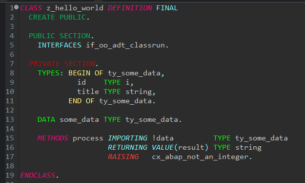
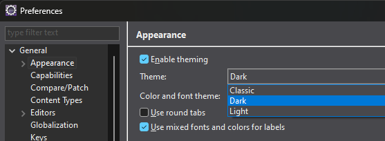
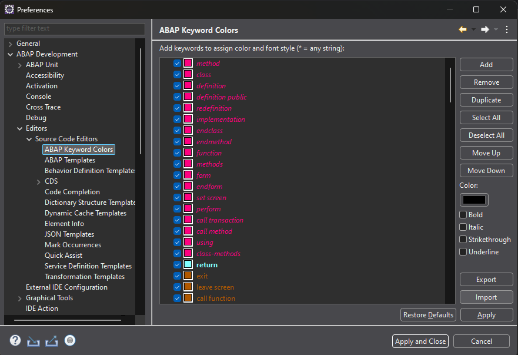

# ABAP syntax highlighting for Eclipse

**Installation**

1. Install the ADT Plugin for Eclipse.
2. Switch to the dark mode.
   1. Open _Window_ > _Preferences_ > _General_ > _Appearance_
   2. Under _Theme_ select _Dark_ and save it via the _Apply_ button.
   
3. Import the Keyword Highlighting
   1.  In the _Preferences_ window go to _ABAP Development_ > _Editors_ > _Source Code Editors_ > _ABAP Keyword Colors_
   2.  Press the _Import_ button on the bottom right and import the `colorSettings.xml` file from this repo.
   3.  Save it via _Apply and Close_
   
